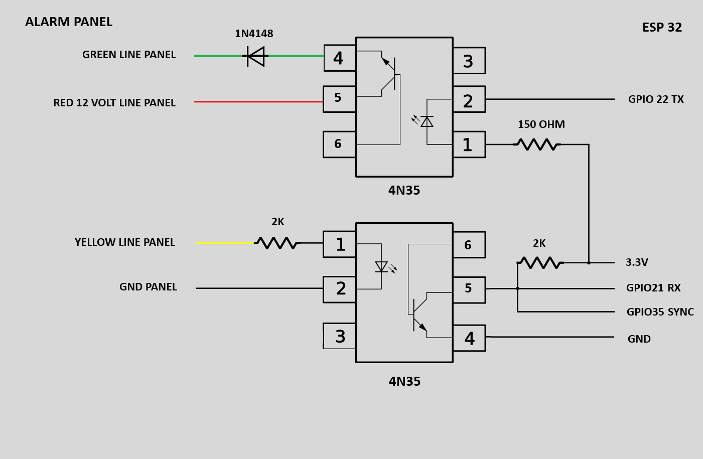

# ESP32 Ademco Keypad (Address 31) Bus Interface — Non-Addressable Panels

Interface legacy, non-addressable Ademco/Honeywell alarm panels (keypad **Address 31**) with **Home Assistant** via an ESP32 — **without altering your alarm's hardware security**.

Unlike modern Vista panels (which use ECP addressable keypads), older generations drive a continuous **2400-baud** keybus that projects like AlarmDecoder or Envisalink cannot read. This firmware reads that bus directly and reconstructs the full panel state from the three keybus wires.

> ⚠️ **Status:** actively developed and **fully tested on an Ademco 4120 with a 4127 fixed-word keypad.** Firmware is at **v19**, which handles mains-loss (blackout) behaviour correctly. Other panels/keypads are listed as *likely* compatible but are **untested** — see the compatibility and protocol-landscape sections.

---

## 📑 Table of contents

- [Which quadrant are you in?](#-which-quadrant-are-you-in-protocol-landscape)
- [Features](#-features)
- [How it works — the polling trick](#-how-it-works--the-polling-trick)
- [Key protocol discoveries](#-key-protocol-discoveries-ademco-4120--4127)
- [Mains loss (blackout) handling](#-mains-loss-blackout-handling-v19)
- [Why B0 is not used for state](#-why-b0-the-display-byte-is-not-used-for-state)
- [Cross-check against gregrenda](#-cross-check-against-gregrendas-6150-mapping)
- [Keypad-specific mapping](#-keypad-specific-mapping-read-this-before-porting)
- [Hardware](#-hardware)
- [Powering the ESP32](#-powering-the-esp32)
- [Customising zone names](#-customising-zone-names-for-your-alarm)
- [Compatibility](#-compatibility)
- [Contributing](#-contributing-help-build-the-universal-map)
- [Limitations / to-do](#-known-limitations--to-do)
- [License](#-license)
- [Credits](#-credits)

---

## 🧭 Which quadrant are you in? (protocol landscape)

Ademco non-addressable panels speak (at least) **two different dialects** on the same physical bus, depending on the **keypad type** in use. This matters more than the panel model:

| | Fixed-word keypad (4127, 4137, 5137, 6128, 6150) | 2-line alphanumeric keypad (6160, 6160RF, 6160V) |
|---|---|---|
| How state is sent | encoded in segment/LED bits (fixed words + zone number) | sent as free display text to be parsed |
| This project | yes, covers this (4127 segment map) | no |
| gregrenda/ademco | yes (6150 segment map) | no |
| AlarmDecoder / VistaECP | no (addressable ECP only) | no (addressable ECP only) |

Both this project and gregrenda's are in the **fixed-word / non-addressable** quadrant — they differ only in *which* fixed-word keypad they map (4127 here, 6150 there), and the segment-bit positions differ between those two models. Neither covers the **2-line alphanumeric** 6160 family, where state arrives as free text and needs string parsing instead of bit decoding.

> **Official confirmation:** the Ademco 4120XM program sheet states the panel supports 6128/6150 keypads and explicitly does **not** support 6160 alphanumeric keypads. Both 6128 and 6150 are fixed-word keypads (Honeywell's own 6150/6160 guide lists the 6150 as "Fixed-Word Display" and the 6160 as "2-Line Alpha Display"), so the panel's supported set is entirely fixed-word — the family this project targets. The keypad address procedure documented by Ademco sets the keypad to **address 31**, i.e. the non-addressable mode targeted here.

---

## ✨ Features

Exposed to Home Assistant:

- **Arming state**: disarmed / armed total / armed partial (Stay)
- **MAX and INSTANT** modes correctly recognised (not mistaken for an alarm)
- **Alarm** detection, with a robustness filter that never suppresses a real alarm
- **Triggered zone on alarm**: the zone that set off the alarm is decoded and named, using a voting window for reliability
- **Open-zone scan** on demand (simulates the `*` keypress)
- **Chime**, **Ready / Not Ready**, **Bypass (zone excluded)** status
- **Mains (AC 220 V) presence** — detected via the dedicated "NO AC" bus frame, with hysteresis
- **Low-battery** flag (see the important caveat below)
- **Named zones** instead of bare numbers (e.g. "TAPPARELLE PT" instead of "4")
- A custom **Lovelace keypad card** (mobile-friendly) mirroring the physical keypad, with RETE (mains) and BATT badges

---

## 🚀 How it works — the polling trick

Legacy Address-31 panels do **not** broadcast individual zone states in real time; they only show open zones on the keypad display when a user interacts with it. To read open zones on demand, the firmware:

1. On request from Home Assistant, briefly simulates a press of the `*` key.
2. The panel forces a display refresh, cycling the open zones onto the bus.
3. The firmware decodes each open zone from the **separator byte** that precedes the `0x0C` status frame, using `zone = (0xFC − separator) / 8`.
4. After a fixed **14-second** window the scan closes automatically and the firmware exits display mode by sending `code + 1`, returning the panel to idle.

The triggered-zone-on-alarm feature uses the **same separator decoding**, read automatically while an alarm is active — no keypress needed.

### Why a voting window for the alarm zone?

During an alarm the separator can cycle and occasionally include a spurious zone. Instead of trusting a single frame, the firmware collects separators over a **4-second window** and publishes the **most frequent** zone (ties go to the first seen). This is robust against a single misread frame — important on an ESP32 synchronising on a hardware clock pin.

---

## 🧠 Key protocol discoveries (Ademco 4120 / 4127)

All values captured empirically on a real bus. Frames are 4 bytes (B0-B3) preceded by a separator byte. **State is read from B1/B2/B3 and the status frame; B0 is the display byte and is not used for state** (see its own section below).

### Status frame `0x0C` — state matrix (with and without mains)

| State | Mains | B0 | B1 | B2 | B3 | Read as |
|---|---|---|---|---|---|---|
| Total / Instant | ON | 9B | 6C | D6 | 5D | armed_total |
| Partial (Stay) | ON | 9B | 6C | D6 | 5D | armed_partial * |
| Total / Partial | OFF | 5B | 6C | D6 | 5D | same state, only B0 differs |
| MAX | ON | 19 | DF | D6 | D6 | armed (B3 bit1+bit7) |
| ALARM (from any state) | ON | 1F | 16 | DF | 2B | alarm |
| Disarmed, chime ON | ON | D6 | CD | 17 | 6C | disarmed |
| Disarmed, chime OFF | ON | 16 | CD | 17 | 6C | disarmed (only B0 differs) |
| NO-AC message frame | OFF | var | DF | 6C | 5E | mains absent (not a state) |

`*` Total vs Partial is **not** in the `0x0C` frame (identical): it comes from bit6 of the second `0x04` frame. **Key point:** in armed states B1/B2/B3 are identical with and without mains, so armed/alarm remain readable during a blackout.

### Alarm vs MAX discrimination

| Condition | B3 bit1 (0x02) | B3 bit7 (0x80) | Meaning |
|---|---|---|---|
| Normal armed | 0 | 0 | no alarm |
| MAX armed | 1 | 1 | MAX, not alarm |
| Real alarm | 1 | 0 | ALARM |

```c
// Separates MAX from a genuine alarm; never suppresses a real alarm:
alarm = ((b3 & 0x02) != 0) && ((b3 & 0x80) == 0);
```

B3 bit7 is the INSTANT bit. MAX = "armed away + instant", so it sets bit7; a genuine alarm always produces `0x2B` (bit7 = 0), confirmed by triggering a real alarm from MAX.

### Zone mapping (separator before `0x0C`)

| Separator | Zone | Example name |
|---|---|---|
| F4 | 1 | BASCULANTI |
| EC | 2 | PORTA INGRESSO |
| E4 | 3 | VOLUMETRICO PT |
| DC | 4 | TAPPARELLE PT |
| D4 | 5 | VOLUMETRICO 1P |
| CC | 6 | TAPPARELLE 1P |
| C4 | 7 | TAMPER |
| BC | 8 | TAMPER COMB |

Passive zone reading (without `*`) is **not** reliable: with everything closed, the separator cycles on its own. Always use the `*` scan or read during an actual alarm.

### State bit sources (reliable)

| Signal | Source | Logic |
|---|---|---|
| Armed | 0x0C, B2 bit7 (0x80) | active high |
| Total / Partial | second 0x04, bit6 | partial_seen |
| Alarm | 0x0C, B3 bit1 and not bit7 | see above |
| Ready | status frame, B2 bit1 (0x02) | active low |
| Bypass | status frame, B2 bit7 (0x80) | active low |
| Chime | status frame, B3 bit1 (0x02) | inverted when bypass active |
| Low battery | status frame, B2 bit6 (0x40) | active low |
| Mains 220 V | presence of NO-AC frame | see blackout section |

---

## 🔌 Mains loss (blackout) handling (v19)

Mains presence is **not** a status bit. When the 220 V fails, the panel **alternates** the real state frame with a dedicated message frame that turns off the RETE (mains) segment on the LCD. That message frame is recognised by:

```
B1 == 0xDF && B2 == 0x6C && B3 == 0x5E     (B0 ignored)
```

This is unique — the only other frame with B1=0xDF is MAX, which has B2/B3 = D6/D6. **Do not** recognise this frame by B0: in real logs it appeared as both `D9 DF 6C 5E` and `19 DF 6C 5E` (the display bits in B0 change with chime state), and B0 with B2=0x6C would otherwise make an *armed* system look *disarmed* during a blackout.

Firmware behaviour in blackout:

| Aspect | Behaviour |
|---|---|
| Mains 220 V sensor | ASSENTE on first NO-AC frame; PRESENTE after 25 s with no NO-AC frame (hysteresis) |
| Why hysteresis | in blackout the frames alternate every ~5-10 s; without it the sensor would oscillate |
| armed / alarm | always live: the real state frame keeps coming, B1/B2/B3 unchanged |
| chime / ready / bypass | frozen at last known value (the blackout frame sequence makes them unreliable) |
| NO-AC frame | discarded: never enters state logic |

This means **an alarm during a blackout is still detected** — the alarm frame (`1F 16 DF 2B`) is distinct from the NO-AC frame and continues to be processed.

---

## 🖥️ Why B0 (the display byte) is not used for state

B0 drives the two-digit display plus the surrounding segment words. Per the panel manual the LCD shows: digits + ALARM/CHECK/FIRE (left), AWAY/STAY/INSTANT/BYPASS (centre), NO AC/CHIME/BAT (top right), NOT READY (bottom right).

B0 is **multiplexed**: the same high bits drive different segments depending on which refresh frame you're looking at. Proof from real logs: `B0 = 0xD6` appears both with "chime ON, bypass OFF" and with "chime OFF, bypass ON" — the same byte value for two different real states. A byte that returns the same value for different conditions cannot be decoded frame-by-frame. Every indicator B0 shows is already available cleanly elsewhere (chime/bypass from the status frame, mains from the NO-AC frame, armed/alarm from B2/B3), so B0 is documented here only as a **warning**, never used for state. Independently, gregrenda's 6150 mapping also assigns **no** bits to B0 — two separate reverse-engineering efforts both leave it alone.

---

## 🔬 Cross-check against gregrenda's 6150 mapping

[gregrenda/ademco](https://github.com/gregrenda/ademco) reverse-engineered the same non-addressable bus for the **6150 keypad** — which is also **fixed-word**, like the 4127 here, just a different model with a different segment layout. Converting his bit constants to byte.bit positions:

| Signal | This project (4127) | gregrenda (6150) | Match |
|---|---|---|---|
| ALARM | B3 bit1 (0x02) | B3 bit1 (0x02) | identical |
| INSTANT (MAX marker) | B3 bit7 (0x80) | B3 bit7 (0x80) | identical |
| STAY / ARMED | B2 bit7 (0x80) | B2 bit7 (0x80) | identical |
| BAT (low battery) | B2 bit6 (0x40) | B2 bit6 (0x40) | identical |
| CHIME | (4127-specific) | B3 bit5 (0x20) | diverges |
| BYPASS | (4127-specific) | B3 bit4 (0x10) | diverges |
| READY | (4127-specific) | B2 bit4 (0x10) | diverges |

The four "deep" state bits match exactly — they're keypad-independent. The diverging ones are exactly the bits gregrenda marks "6150 only": since the 4127 and 6150 are **different fixed-word models**, the panel packs those segment bits differently for each. That's the whole reason a separate 4127 map was needed — same protocol, same display *class*, but a different segment layout per model. Timing also converges: gregrenda uses `FRAME_MS = 176` with a sync threshold of `(176−5) = 171 ms`, identical to this firmware's `SYNC_MIN_US = 171000`.

---

## 🔀 Keypad-specific mapping (read this before porting)

The byte mappings here were reverse-engineered with a **4127 fixed-word keypad**. The panel adapts its bus output to the keypad type, so:

- **4137** — sister of the 4127 (same fixed-word display, backlit + larger). Almost certainly the same frames; likely works unmodified, unconfirmed.
- **5137** — also fixed-word, listed alongside the 4127/4137 on the panel's connection diagram (current draw 90 mA vs 20 mA for the 4127). Same family, likely compatible, unconfirmed.
- **6128** — fixed-word, same family; grouped with 6150 for addressing in the program sheet.
- **6150** — also fixed-word (Honeywell classes it as "Fixed-Word Display"). Mapped by gregrenda; its segment bits differ from the 4127 for chime/bypass/ready/AC, so it isn't drop-in, but it's the same display class.
- **6160 / 6160RF / 6160V (2-line alphanumeric)** — a genuinely different paradigm: state is sent as free display **text**, not segment bits. The method (bus tap, timing, sync) transfers, but the decoding is string parsing, not bit reading. Not covered here.

> **Localised variants:** Ademco produced country-localised keypads (e.g. an Italian version showing RETE / PRONTO / NON PRONTO instead of AC / READY / NOT READY). These are electrically identical — the bus sends segment bits, not text, so the silk-screened label on the glass is the only difference. The bit mapping is the same.

If you have a different keypad, capture a bus log with `diagnostic_mode: true` — the approach still works, only the constants change. **PRs adding a keypad column are welcome.**

---

## 🛠️ Hardware

| Item | Detail |
|---|---|
| MCU | ESP32 NodeMCU-32S |
| RX | GPIO21 (inverted, via 4N35 optocoupler) |
| TX | GPIO22 (RMT, key transmission) |
| Sync | GPIO35 (inverted) |
| Bus | 2400 baud, 8E2 |
| ESPHome | **2025.3.3** (see note below) |

> **ESPHome version:** this component is built and tested on **ESPHome 2025.3.3**. It uses the legacy ESP-IDF RMT driver (`driver/rmt.h`) for key transmission, which was removed in recent ESP-IDF releases — so newer ESPHome versions (that ship a newer ESP-IDF) will fail to compile until the RMT code is ported to the new `esp_driver_rmt` API (see to-do). Pin ESPHome to 2025.3.3 (`pip install esphome==2025.3.3`) to build as-is.

An optocoupler on the RX line safely level-shifts and isolates the keybus from the ESP32. The bus interface circuit is inspired by gregrenda's optocoupler approach, redrawn for this wiring.

### Connections

Three signal lines connect the ESP32 to the keybus, plus power and a common ground. All three ESP32 signal pins go through opto-isolation — the ESP32 never touches the bus directly.

| ESP32 pin | Role | Direction | Notes |
|---|---|---|---|
| **GPIO21** | Data RX (read the bus) | input | Via optocoupler, **inverted**. Read as a UART at 2400 baud, 8E2. This is the panel→keypad data stream the firmware decodes. |
| **GPIO22** | Data TX (send keys) | output | Via optocoupler. Driven by the **RMT** peripheral to reproduce keypad key-presses back to the panel with correct bit timing. |
| **GPIO35** | Sync | input | Via optocoupler, **inverted**. The bus clock/framing reference — see below. GPIO35 is input-only on the ESP32, which is fine since sync is read-only. |
| GND | Common ground | — | ESP32 ground and the isolated bus-side ground per the optocoupler wiring. |
| 12 V / power | Supply | — | See *Powering the ESP32* below. |

### Why a separate sync pin

This is the non-obvious part of the design. The Ademco keybus is **not** a self-clocking UART you can just read on one pin — the data stream has to be aligned to the panel's frame boundaries, or you decode garbage. The panel signals those boundaries on the bus, and this firmware watches them on a **dedicated sync line (GPIO35)** to know where each frame starts.

Concretely: a separate high-priority task pinned to core 0 watches the sync pin for the inter-frame gap (a quiet period longer than `SYNC_MIN_US`, ~171 ms). When it sees that gap, it knows the next bytes on the RX line are the start of a fresh frame, and re-aligns the parser. Without this, the byte stream on GPIO21 alone would drift out of frame alignment and the whole decode falls apart. So the sync pin isn't optional decoration — it's what keeps the 4-byte frames correctly framed. (This matches gregrenda's timing: the ~171 ms threshold is `FRAME_MS − 5`.)

In the ESPHome YAML the three pins are declared like this (note the `inverted: true` on RX and sync, matching the optocoupler polarity):

```yaml
uart:
  rx_pin:
    number: GPIO21
    inverted: true
  baud_rate: 2400
  # 8E2 framing

ademco4110:
  sync_pin:
    number: GPIO35
    inverted: true
  diagnostic_mode: false
  # TX is GPIO22 (RMT), set in the component
```

### Circuit schematic



Two **4N35** optocouplers isolate the ESP32 from the keybus:

- **RX opto (bottom):** the panel's YELLOW data line drives the LED (pin 1) through a **2 kΩ** series resistor, cathode to panel GND (pin 2). On the output side the transistor collector (pin 5) has a **2 kΩ pull-up to 3.3 V**, and that single node feeds **both GPIO21 (RX)** and **GPIO35 (SYNC)** in parallel — one optocoupler serves both the data stream and the frame-sync reference. Emitter (pin 4) to ESP32 GND.
- **TX opto (top):** GPIO22 drives the LED side through a **150 Ω** resistor; the output (pin 2) returns to the panel's GREEN data line via a **1N4148** diode. The RED 12 V line from the panel is only a reference here — it is **not** used to power the ESP32 (see below).

Note the 4N35 is a 6-pin device (pinout differs from the 4-pin PC817 used in gregrenda's original circuit).

---

## 🔌 Powering the ESP32

**Power the ESP32 from a separate supply** (a USB adapter or an independent 5 V/3.3 V source) — **not** from the panel's 12 V line.

> ⚠️ **Do not power the ESP32 from the panel's 12 V (the RED line).** The whole point of the two optocouplers is **galvanic isolation** between the ESP32 and the alarm bus: the two sides share no electrical connection, only light. If you also draw power from the panel, you tie the ESP32 ground to the panel ground and **destroy that isolation** — defeating the optocouplers entirely and exposing both the ESP32 and the panel to ground loops, noise coupling, and fault propagation between the two. Keep the two sides electrically separate: the ESP32 side has its own supply and its own ground; the panel side connects only through the optocouplers. The RED 12 V line in the schematic is a reference/landmark on the panel connector, not a supply tap.

**Trade-off to be aware of:** with a separate supply, if mains fails the ESP32 goes down even though the panel keeps running on its battery — so you lose HA visibility during a blackout. That's the price of keeping the isolation intact. If you need blackout visibility, power the ESP32 from a **small independent battery/UPS on its own side** (e.g. a USB power bank or a dedicated isolated DC-DC with its own battery), never from the panel's battery — that way the isolation is preserved and the ESP32 survives the outage on its own power. Mains-loss itself is still reported by the firmware (the NO-AC frame) as long as the ESP32 is powered.

---

## 🏷️ Customising zone names for your alarm

The panel scrolls zone **numbers** (1–8) on the bus; the human-readable names are mapped in the firmware in a single array. To adapt them to your own installation, edit **`ZONE_NAMES` in `ademco4110.h`**:

```cpp
static constexpr const char* ZONE_NAMES[9] = {
    "",                    // index 0 — unused (zones are 1-based)
    "BASCULANTI",          // zone 1
    "PORTA INGRESSO",      // zone 2
    "VOLUMETRICO PT",      // zone 3
    "TAPPARELLE PT",       // zone 4
    "VOLUMETRICO 1P",      // zone 5
    "TAPPARELLE 1P",       // zone 6
    "TAMPER",              // zone 7
    "TAMPER COMB"          // zone 8
};
```

Just replace the strings with your own zone labels, keeping the position = zone number (index 0 stays empty because zones are numbered from 1). The values shown are the author's layout — yours will differ. After editing, recompile and reflash.

> Note: zones 3 and 5 here are the interior PIRs the panel auto-excludes on **Partial/Stay** arming — that's why their numbers scroll on the bus during a partial arm (see the contextual-zone-read note). Yours may map differently; check which of your zones are the interior motion detectors.

If you later want names to live in configuration instead of code (so renaming a zone doesn't need a recompile), you could move this lookup to the ESPHome YAML or to Home Assistant — but as shipped, the array above is the one place to edit.

**Likely compatible but UNTESTED** — feedback and logs welcome:

- Ademco 4110, 4110XM, 4110DL
- Ademco 4120EC, 4120XM, 4140XMP
- Ademco 5110XM
- Vista-10 / Vista-10SE
- Vista-15 (early models)
- Vista-20 / Vista-20SE *in Address-31 mode*

...**with a fixed-word keypad (4127 / 4137 / 5137 / 6128 / 6150).** With a 2-line alphanumeric keypad (6160 family) the state arrives as text, not these bits — see the keypad section.

**Discoverability keywords:** non-addressable Ademco, Address 31, Ademco 4110/4120/4120XM Home Assistant, Vista-10 Vista-10SE Home Assistant, AlarmDecoder alternative for older panels, fixed-word keypad 4127 6128 6150, ESPHome Ademco keybus.

If you try this on a panel/keypad not in the tested list, please open an issue with a bus log — your data helps map other models.

---

## 🤝 Contributing (help build the "universal" map)

There is no single universal decode for these panels — each keypad type is a column in a table that only gets filled by people with different hardware. This repo is meant to be that collection point:

1. Flash the firmware with `diagnostic_mode: true`.
2. Exercise your system (arm total / stay / max, trigger a test alarm, open zones).
3. Capture the raw frames from the log.
4. Open an issue or PR with your **panel model + keypad model + frames**.

Cheap second-hand boards (4110/4120 series) are widely available and make a safe bench rig for this — no need to experiment on your live panel.

---

## 🚧 Known limitations / to-do

- **Mains (AC) detection**: confirmed via the dedicated NO-AC frame (`B1=0xDF B2=0x6C B3=0x5E`); B0 is ignored (multiplexed display byte). During a blackout chime/ready/bypass are frozen at their last known value; armed/alarm remain live and accurate.
- **Low-battery** flag is a coarse fault indicator, not a health gauge. On these old panels it's set only when a periodic weak load-test fails — it flags a dead/disconnected battery, not a degrading one. Treat it as a fault indicator, not a health readout; for real health, measure battery voltage directly.
- **CHECK indicator** (loop trouble / faulty sensor wiring) is visible on the keypad display but **not yet mapped** on the bus. Unlike mains/battery it can't be safely toggled on demand — it reflects a real loop fault (open wiring, bad EOLR). A candidate exists from the gregrenda cross-check (B2 bit1 of the 0x0C frame) but it may instead be a message frame carrying the faulty zone number, like the NO-AC and zone frames. To be mapped opportunistically: with `diagnostic_mode: true`, open an EOLR-supervised zone loop (e.g. disconnect the HI wire of a supervised zone for a minute) and capture the log, or wait for a real fault.
- **Alarm during blackout**: logic is safe by construction (the alarm frame is distinct from the NO-AC frame and always processed), but not yet captured live. To confirm: arm the system, disconnect mains, trigger a test alarm.
- **Keypad beep detection** (not yet mapped): the panel drives the keypad's buzzer over the bus, and the beep patterns encode discrete events that would be a clean, glitch-free alternative to reading continuous state bits. Observed grammar on the 4127: single beep = chime toggled on/off, single beep = bypass toggled, one beep per excluded zone shown on the display, two quick beeps = armed total, three quick beeps = armed partial (Stay). These are events (they fire once, at the moment of the action) rather than states, so they don't suffer the flicker that state bits can show. To map: with `diagnostic_mode: true`, perform each action (toggle chime, exclude a zone, arm total/partial) and capture which frame appears at the instant of the beep.
- **RMT driver port (ESPHome > 2025.3.3)**: key transmission uses the legacy ESP-IDF RMT driver (`driver/rmt.h`), removed in newer ESP-IDF. To build on newer ESPHome, port the two TX functions (`rmt_tx_init`, `rmt_tx_send_key`) to the new API (`rmt_new_tx_channel` + copy encoder + `rmt_transmit` + `rmt_tx_wait_all_done`, headers `driver/rmt_tx.h` / `driver/rmt_encoder.h`), and declare the `esp_driver_rmt` component dependency in the build (in IDF 5.5 the new RMT driver lives in that separate component, not pulled in by ESPHome by default). The RMT handles TX only (key sending) — it does not touch bus reading, so this is a compatibility change, not a reliability one.
- Compatibility beyond the 4120/4127 is theoretical.
- Zone names are hard-coded (edit the `ZONE_NAMES` array to match your installation).
- Firmware comments/logs are in Italian; protocol documentation (this README + the PDF) is in English.

---

## 📄 License

Released under the **Creative Commons Attribution-NonCommercial-ShareAlike 4.0 International License (CC BY-NC-SA 4.0)**.

- **Free for personal/home use** — replicate, modify and use on your own system.
- **Share and adapt** — with attribution, under the same license.
- **No commercial use** — you may not sell pre-assembled modules nor commercialise this software or forks of it.

Full text: https://creativecommons.org/licenses/by-nc-sa/4.0/

> Creative Commons licenses were designed for creative works rather than software, but are used here intentionally: the goal is a clear non-commercial restriction, which standard OSS licenses (MIT, GPL, etc.) do not provide.

---

## 🙏 Credits

Protocol reverse-engineering builds on insights from [gregrenda/ademco](https://github.com/gregrenda), whose work on non-addressable Ademco panels (6150 fixed-word keypad) provided cross-checks for several state bits and the bus timing, and inspired the optocoupler bus-interface circuit. This project maps a **different fixed-word model (the 4127)**, whose segment bits differ from the 6150, and ports the result to **ESP32 / ESPHome** with native Home Assistant integration through empirical bus capture on a 4120 / 4127.

Panel behaviour cross-referenced against Ademco's own 4120SP/4120XM connection diagram and program sheet (keypad families and current draw, Address-31 procedure, 700 mA aux rating, NO AC / BAT semantics, 12 V 7 Ah battery, display segment layout).
